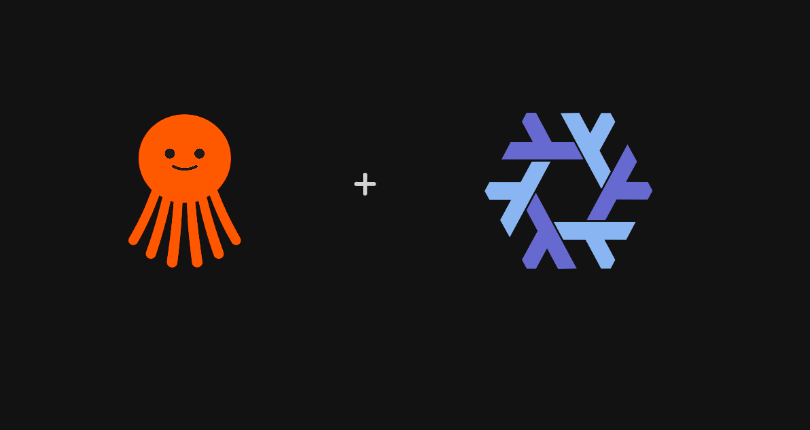

# Octra — AI agent factory powered by Nix

Octra is a multi-agent AI orchestrator that builds software projects using a Boss → Manager → Worker pipeline. Every project is snapshotted into the [Nix](https://nixos.org) store, enabling instant rollback and zero-storage recovery.

## Architecture (Boss → Manager → Worker)

> Full API specification for custom clients → [`docs/spec/`](docs/spec/OCTRA-SPECIFICATION.md)



```
User → API Gateway → Boss (architect)
                        ├── Manager (backend) → Worker × N
                        ├── Manager (frontend) → Worker × N
                        └── Manager (devops)  → Worker × N
                              ↓
                        Agents Service → Claude / Gemini / GPT / ...
```

**Boss** plans architecture, spawns managers, validates output, pushes to GitHub.  
**Managers** review and orchestrate workers.  
**Workers** generate code inside Nix-isolated environments — either via AI or real tool scaffolding. 

## Philosophy

Octra's core principle: **AI is a genius but untrustworthy brain — the system is a rigid shell that controls it.**

AI tends to overcomplicate, add features no one asked for, hallucinate APIs, and deviate from the task. Octra does not fight this — it contains it:

- **Divide and conquer** — a single complex task is broken into many small, narrow AI calls (Boss → Manager → Worker). Each call answers exactly one question, with no room for creativity.
- **JSON-only responses** — every prompt demands structured output. AI does not narrate, justify, or explore — it answers precisely and moves on.
- **Every step is validated** — Boss validates the final result, Manager reviews worker output, failed commands are retried with error context. No output is trusted without verification.
- **No system prompt roleplay** — AI does not need to "act like a senior engineer." It needs to follow instructions exactly and produce parseable results.
- **Determinism over creativity** — low temperatures, constrained output formats, explicit rules for every decision. Predictability is more valuable than cleverness.
- **Context as a resource, not a story** — project context is stored as structured entries with scopes and importance flags, not as conversation history. AI does not "remember" — it is told what it needs to know.

This is not a limitation — it is the feature. Octra treats AI as a reliable executor within a controlled system, not as an autonomous agent. 

## Tool scaffolding pipeline

Octra can scaffold real projects using native toolchains inside `nix develop`:

```
setupProject() → FlakeBuilder(techStack) → ToolExecutor(generateViaTools)
                                              ├── npm init / cargo init / flutter create / …
                                              ├── AI generation fallback if Nix/tool unavailable
                                              └── git status --porcelain to detect created files
```

- **FlakeBuilder** generates `flake.nix` with Nix packages for 20+ tech stacks
- **ToolExecutor** runs real scaffolding commands (`npm install`, `cargo init`, `composer create-project`, etc.)
- Graceful fallback to AI generation if Nix or tool is unavailable

## Command error auto-fix

When a scaffolding command fails (non-zero exit), its output is fed back to the AI for automatic fixing:

```
Worker generates code → runs commands → exit code ≠ 0
                                         ↓
                  AI receives error + current files → returns fixed files
                                         ↓
                              patched files written to disk
```

Only errors trigger the fix (successful command output is ignored). Each failed command gets one fix attempt.

## Stream reliability

Progress updates from the Boss → Manager → Worker pipeline are delivered via a buffered channel (256 slots) with blocking sends — no updates are dropped. Previously used non-blocking sends with `select default:`, which silently dropped file-write progress when the channel was full.

## Structured tool guides (`pkg/guids`)

Octra ships with a registry of structured tool guides — one file per tool, organized by language ecosystem:

```
pkg/guids/
├── core/               # Guide type, registry, formatting
├── golang/             # go
├── rust/               # cargo
├── node/               # npm
├── python/             # pip
├── java/               # maven, gradle, kotlin/
├── php/                # composer, artisan
├── flutter/            # flutter
├── cpp/                # cmake
├── dotnet/             # dotnet
├── elixir/             # mix
├── haskell/            # cabal
├── zig/                # zig
├── swift/              # swiftpm
└── ruby/               # bundler, gem
```

Each guide contains structured commands, Nix packages, and project structure — injected into AI prompts to prevent hallucinated commands and save tokens.

## Context management system (`internal/service/context/`)

Octra maintains per-project context with three visibility scopes, stored in Redis (fast cache) and PostgreSQL (permanent storage):

```
                        ┌──────────────────┐
                        │  AI Agent returns │
                        │  JSON with        │
                        │  "context" field  │
                        └──────┬───────────┘
                               ↓
               ┌───────────────────────────────┐
               │  ContextService.SaveFromAI()   │
               │  ┌──────────┐  ┌────────────┐ │
               │  │ Postgres │  │   Redis    │ │
               │  │ (always) │  │ (5min TTL) │ │
               │  └──────────┘  └────────────┘ │
               └───────────────────────────────┘
                               ↓
               ┌───────────────────────────────┐
               │  GetForPrompt() → injects     │
               │  into Boss/Manager/Worker      │
               └───────────────────────────────┘
```

**Three scope levels:**

| Scope | Visibility | Set by | Lifecycle |
|-------|-----------|--------|-----------|
| `global` | All agents in project | Boss/Manager | Persists forever |
| `team` | All workers under one manager | Manager | Until manager finishes |
| `individual` | Single agent | Any agent | Per agent session |

**How context flows:**

1. **Boss** sends prompt → AI returns JSON with optional `"context": {"scope": "global", "type": "global_rule", "content": "..."}`
2. **ContextService** saves to Postgres + Redis, then injects into all subsequent agent prompts
3. **Manager** and **Worker** also receive and can create context (team/individual scopes)
4. Before every AI call, `GetForPrompt()` assembles all relevant context into a formatted block

**Automatic cleanup:**

- **Messages** capped at ~20 (adaptive: 40 if avg length <200 chars, 30 if <500 chars)
- When limit exceeded, the **5 oldest non-important** messages are removed (sawtooth pattern)
- **Global rules** live forever unless user says `"forget"`
- If user/AI sends `"content": "forget"` → all matching entries are marked `forgotten`
- Redis entries expire after 5 minutes, reloaded from Postgres on next access

**Key files:**

| File | Purpose |
|------|---------|
| `internal/service/context/response.go` | AI context flag parsing, forget detection |
| `internal/service/context/postgres.go` | Permanent storage, adaptive cleanup |
| `internal/service/context/redis.go` | TTL cache (5 min), cache-aside pattern |
| `internal/service/context/service.go` | Coordinator, SaveFromAI, GetForPrompt |
| `pkg/models/context_entry.go` | GORM model (project_id, scope, type, content, …) |

## Group Chat Agent Orchestration (`internal/service/groupchat/`)

Octra's workers use the **Group Chat** pattern ([Microsoft Agent Framework](https://learn.microsoft.com/en-us/agent-framework/workflows/orchestrations/group-chat)) for true multi-agent collaboration:

```
Round 1: all agents generate concurrently (AllAtOnceSelector)
         Worker A ──→ Message{files}
         Worker B ──→ Message{files}
         Worker C ──→ Message{files}
                ↓ broadcast
Round 2: each agent sees full conversation → can refine based on peer work
         Worker A ──→ sees B+C files → improves
         Worker B ──→ sees A+C files → improves
         Worker C ──→ sees A+B files → improves
                ↓ termination condition
         git add . + git commit
```

**How agents "check the chat":**

Every agent's `Process(ctx, conv)` receives the full `Conversation` with all messages and files. `WorkerAgent.buildChatContext()` extracts peer-generated files and content, injects them into the AI prompt — workers literally see what others built and can adapt.

**Key components:**

| File | Purpose |
|------|---------|
| `internal/service/groupchat/types.go` | Agent, Message, Conversation, SpeakerSelector interfaces |
| `internal/service/groupchat/orchestrator.go` | Orcherator: registration, concurrent rounds, termination |
| `internal/service/groupchat/selection.go` | RoundRobin, AllAtOnce, RoleBased, AgentBased selectors |
| `internal/service/rules/worker/agent.go` | `WorkerAgent` implementing `groupchat.Agent` with AI generation |

## Skill Warehouse (`internal/skills/`)

Octra ships with a **Skill Warehouse** — a registry of atomic skill fragments that replace monolithic skill files. Instead of sending entire skill documents to every AI call, the system picks only the relevant fragments:

### Fragments instead of monoliths

Traditional skills (7 large `.md` files) were broken into **42 atomic fragments** (3-6 lines each):

```
internal/skills/fragments/
├── backend-api.md, backend-arch.md, backend-data.md, backend-security.md, ...
├── frontend-component.md, frontend-state.md, frontend-accessibility.md, ...
├── devops-cicd.md, devops-containers.md, devops-iac.md, ...
├── research-intent.md, research-sources.md, research-triangulate.md, ...
├── presentation-slide.md, presentation-story.md, presentation-visual.md, ...
├── proxy-types.md, proxy-headers.md, proxy-security.md, ...
└── vpn-protocol.md, vpn-crypto.md, vpn-network.md, ...
```

### Warehouse API

```go
warehouse := skills.NewWarehouse()
warehouse.Catalog()                    // всё что есть на складе
warehouse.CatalogFiltered("Backend")   // только указанные категории
warehouse.Search(role, tech, task, 3)  // top-3 фрагмента по релевантности
warehouse.SearchFiltered(role, tech, task, 3, "Backend") // с фильтром по категории
warehouse.Select(slugs...)             // только эти фрагменты → текст для промпта
```

### Category filtering

The Boss can pass `skill_categories` in task metadata — then:

1. **Boss** sees only those categories in the catalog (via `CatalogFiltered`)
2. **Manager** searches fragments only in those categories (via `SearchFiltered`)
3. **Worker** receives only the matching skills

Example:
```json
// task metadata
{ "skill_categories": "Backend, Frontend" }
```

Without the flag — all skills as before (backward compatibility).

### How the Manager picks

After deciding worker roles, the Manager queries the Warehouse:

```
Manager → warehouse.Search("backend go", "go", taskDescription, 3)
       → ["backend-api", "backend-data", "backend-security"]
       → WorkerRole.SelectedSkillSlugs = ["backend-api", "backend-data", "backend-security"]
```

The Worker then resolves only those slugs via `warehouse.Select(slugs...)`, injecting **~15-30 lines** of targeted guidance instead of a full 100+ line skill file.

### Adding new skills

Drop a new `.md` file in `internal/skills/fragments/` with frontmatter:
```yaml
---
name: My New Skill
slug: my-skill
area: MyArea
keywords: relevant, keywords, here
tech: go, python
weight: 3
---
Short guidance text (3-6 lines).
```

The Warehouse discovers it automatically via `//go:embed`.

### Key files

| File | Purpose |
|------|---------|
| `internal/skills/warehouse.go` | Warehouse registry, catalog, search, select, category filter |
| `internal/skills/fragments/*.md` | 42 atomic skill fragments |
| `internal/skills/skills.go` | Legacy skill system (backward compat) |
| `internal/service/rules/worker/skill.go` | `buildSkillContext()` — fragment resolution entry point |
| `internal/service/rules/manager/assign.go` | Manager selects fragments per worker via Warehouse |

## GitHub Integration

Octra can automatically publish generated projects to GitHub and create pull requests for issue-linked tasks. The behavior is configured in the Settings panel via two toggles:

| Toggle | Meta flag | Effect |
|--------|-----------|--------|
| Publish new projects to GitHub | `publish_repositories` | Creates a new GitHub repository and pushes the generated code |
| Create pull requests | `create_pull_requests` | Creates a PR for issue-linked tasks (pushes code to a branch in any case) |

### Data flow

```
Settings (UI) → meta.publish_repositories / meta.create_pull_requests
                                    ↓
                   task.go → pushToGitHub(ctx, task, projectPath, issueTarget, meta)
                                    ↓
                   github.go — checks flags and decides:
                     publish_repositories=false → skip repo creation
                     create_pull_requests=false → push branch only, skip PR
                                    ↓
                   WebSocket response → frontend adds GitHubNode
                     repoUrl → repository link
                     pullRequestUrl → PR link (displayed as "GitHub PR" node)
```

### Frontend behavior

- If both toggles are off (integration connected but disabled) — no GitHub node is added to the canvas
- If a pull request is created — the node shows "GitHub PR" as role and opens the PR URL on click
- If a repository is published — the node shows "GitHub" as role and opens the repo URL on click
- The click handler respects `prUrl` over `repoUrl` when both are present

### Key files

| File | Purpose |
|------|---------|
| `orchestrator/internal/service/rules/boss/github.go` | `pushToGitHub()` with flag-aware repo/PR creation |
| `orchestrator/internal/service/rules/boss/task.go` | Passes `req.Meta` to `pushToGitHub` |
| `frontend/web/src/app/App.tsx` | Sends flags in task creation payload |
| `frontend/web/src/hooks/useWebSocket.ts` | Conditionally adds GitHub node based on flags and response data |
| `frontend/web/src/app/components/nodes/GitHubNode.tsx` | Renders repo/PR link, supports `prUrl` field |
| `frontend/web/src/stores/taskStore.ts` | `AgentNode.prUrl` field |
| `frontend/web/src/components/IntegrationForm.tsx` | UI toggles for publish/PR settings |

## Project lifecycle with Nix

```
setupProject() → generate flake.nix → AI generates code → nix-store --add → cleanup
                                                                 ↓
                                                          RestoreProject(taskID)
```

Each project:

1. Gets a `flake.nix` at creation time (auto-generated per tech stack)
2. Is built by AI agents inside the working directory
3. On completion: **snapshotted to `/nix/store/`** via `nix-store --add`
4. Working directory is removed (zero disk waste)
5. **`RestoreProject(taskID)`** recovers the project from the Nix store instantly

This means projects take zero space when idle but can be restored at any time.

## Services

| Service | Stack | Role |
|---------|-------|------|
| `orchestrator` | Go, gRPC | Boss → Manager → Worker pipeline, Group Chat orchestration, Skill Warehouse, Nix snapshots, tool scaffolding, command auto-fix |
| `agents` | Go, gRPC | AI provider proxy (Claude, Gemini, GPT, DeepSeek, Ollama/custom, …) — supports OpenAI-compatible streaming and non-streaming |
| `apigateway` | Go, Gin, WebSocket | HTTP/WS → gRPC bridge |
| `user` | Go, Gin | Auth, subscriptions, custom providers |
| `frontend/web` | React, Vite, Electron | Interactive canvas + chat UI |
| `grademodel` | Python, scikit-learn | Task complexity grading |

## Nix integration

| File | Purpose |
|------|---------|
| `orchestrator/flake.nix` | Builds orchestrator binary via `buildGoModule` |
| `orchestrator/nix/module.nix` | NixOS module (systemd service) |
| `orchestrator/Dockerfile` | Based on `nixos/nix` — includes Nix in container |
| `orchestrator/internal/service/rules/boss/project.go` | `snapshotProject()`, `RestoreProject()`, `generateFlake()` |
| `orchestrator/internal/service/rules/boss/flake_builder.go` | Dynamic `flake.nix` generation per tech stack |
| `orchestrator/internal/service/rules/boss/nix_build.go` | `nix build`, `nix flake check`, `nix flake lock` |
| `orchestrator/internal/fetcher/grpc/sender.go` | Stream sender with blocking buffered channel (256 slots) — no dropped updates |
| `orchestrator/internal/service/rules/worker/tool_executor.go` | Real tool scaffolding inside `nix develop` |
| `orchestrator/pkg/guids/` | Structured tool guide registry (commands, packages, structure) |
| `orchestrator/pkg/models/context_entry.go` | Context entry GORM model |
| `orchestrator/internal/service/context/` | Context management (Redis + Postgres, 3 scopes, auto-cleanup) |
| `projects/<taskID>/flake.nix` | Auto-generated per project |
| `internal/service/groupchat/` | Group Chat orchestration (star topology, concurrent rounds) |
| `internal/service/rules/worker/agent.go` | `WorkerAgent` — group chat participant with AI generation |
| `internal/skills/warehouse.go` | Skill Warehouse — catalog, search, select, category filtering |
| `internal/skills/fragments/` | 42 atomic skill fragments (3-6 lines each, one per topic) |
| `internal/skills/skills.go` | Legacy skill system (backward compat) |
| `internal/service/rules/worker/skill.go` | `buildSkillContext()` — warehouse fragment resolution |

Run with NixOS:

```nix
{
  imports = [ octra.flake.nixosModules.octra-orchestrator ];
  services.octra-orchestrator = {
    enable = true;
    environment.DB_DNS = "postgres://...";
  };
}
```

## Quick start

```bash
docker compose up -d --build
```

Open http://localhost, describe your task, Octra builds it.  
Project is cached in Nix store — recover anytime via `RestoreProject(taskID)`.

---

*Octra: describe once, rebuild forever.*
