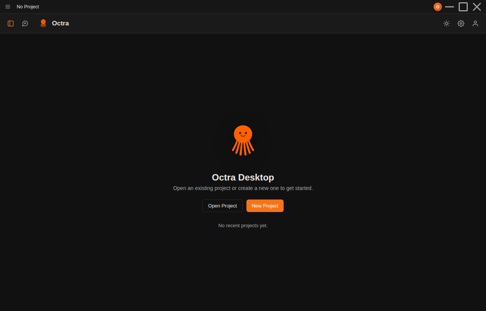
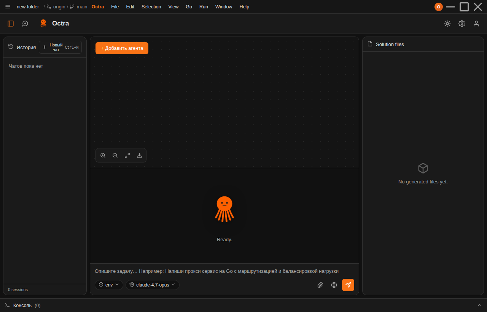

# Octra Desktop

A desktop IDE shell for **Octra** built with **Electron**. It reproduces the live
Octra web app (`frontend/web`) and adapts it for the desktop with a **Zed-style
title bar**, an **application menu**, a **project switcher**, and native
filesystem integration for opening and creating projects.

> Implements [issue #48](https://github.com/Payel-git-ol/Octra/issues/48).

## What it looks like

When **no project is open** the window shows a welcome screen with the real Octra
mascot and the Open / New actions. There is **no File menu** at this point — it
only appears once a project is open.



Once a project is open the window becomes the full **three-pane workspace** that
mirrors the web UI — **История** (sessions) · **Canvas + Octra chat + a shared
composer** · **Solution files** — with the application menu bar in the title bar
and the **Консоль** dock at the bottom.



The chrome reuses the Octra design tokens (`--background`, `--surface`, `--accent`
`#f97316`, `--text`, `--border`, the `Inter` font) and the real mascot artwork
(`octra-mascot.png`) from `frontend/web`, so it reads as the same product as the
web app.

## Architecture

```
src/
  main/
    main.js       Electron main process — frameless window + IPC
    preload.js    contextBridge → window.octra (the only renderer ↔ Node surface)
    menu.js       builds the native menu from the shared model
    projects.js   filesystem integration (open / create / recent), pure Node
  renderer/
    index.html    the desktop shell (title bar + appbar + welcome/workspace + console)
    assets/       octra-mascot.png — the real Octra mascot (shared with the web app)
    styles/
      tokens.css     Octra design system tokens (dark theme default)
      chrome.css     Zed-style title bar, menu, project switcher
      workspace.css  appbar, welcome screen, three-pane workspace, console dock
    js/
      menuModel.js     single source of truth for the menu (shared with main)
      icons.js         inline-SVG icon set (mirrors the web's lucide icons)
      api.js           window.octra in Electron, in-memory mock in a browser
      dropdown.js      shared open/close controller
      appMenu.js       renders the menu bar + dropdowns
      projectSwitcher.js  renders the project switcher
      app.js           boots the shell, gates the menu/workspace on an open project
```

### Project-gated UI

The whole shell switches on `body[data-has-project]`:

- **no project** → welcome screen; the File/Edit/… menu bar and the workspace are
  hidden (per the PR review: _"если не открыт проект то меню файлов быть не должно"_).
- **project open** → three-pane workspace; the menu bar and console dock appear.

There is **no hardcoded project data**: the Recent Projects list starts empty and
is only populated when the user actually opens or creates a project (persisted by
`projects.js` in Electron, kept in memory in the browser preview).

Security: the window runs with `contextIsolation: true` and `nodeIntegration:
false`. The renderer reaches the filesystem only through the explicit, whitelisted
channels in `preload.js`.

## Develop

```bash
cd frontend/desktop
npm install
npm start          # launch the Electron app
```

The renderer is plain HTML/CSS/JS, so it also runs in a normal browser for quick
visual iteration (it falls back to an in-memory project mock when `window.octra`
is absent):

```bash
# from this directory
python3 -m http.server 8099 --directory src/renderer
# then open http://localhost:8099/index.html
```

## Test

Structural and functional checks (no Electron runtime required):

```bash
npm test
```

- `check-projects` — round-trips open / remember / list / create / forget on a temp dir
- `check-menu-model` — the menu bar matches the Zed reference and native+in-window share one model
- `check-topbar` — the Zed-style title bar has all required regions and Octra tokens
- `check-project-switcher` — the switcher has search / This Window / Recent Projects and is wired to the bridge
- `check-electron-main` — frameless, context-isolated window with the expected IPC surface
- `check-workspace` — real mascot, no hardcoded recents, menu/workspace gated on an open project, three-pane web UI
